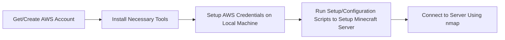

# Creating and Running a Minecraft Server

This README will go through the process of creating the infrastructure for a Minecraft Java server, then being able to connect to it using nmap.

# Background

The creation of the Minecraft Server will be AWS and the EC2 instances. This will be done without going into the AWS console but rather there a terminal where scripts will be doing that process for us. This process documented in the perspective of someone doing this on a macOS, other platforms will be able to do the same thing with minimal changes and will be directly noted about them.

The infrastructure is created using Terraform and there is a bash file that configures the Minecraft Server automatically. The Minecraft server will startup and shutdown using a SystemD script.

# Overview

# Requirements

You will need to install a couple tools to be able to continue with this documentation:

- Terraform - automates infrastructure on cloud services [https://developer.hashicorp.com/terraform/tutorials/aws-get-started/install-cli]
- Follow the instructions for whatever platform you are on, as I was macOS I used HomeBrew.

> brew tap hashicorp/tap
> brew install hashicorp/tap/terraform

- AWS CLI - enables interacting with AWS services on the command line [https://docs.aws.amazon.com/cli/latest/userguide/getting-started-install.html]
- Follow the instructions on however you wish to download the CLI, but I used the command line installer

> curl "https://awscli.amazonaws.com/AWSCLIV2.pkg" -o "AWSCLIV2.pkg"
> sudo installer -pkg AWSCLIV2.pkg -target /

With these tools installed, we then need the AWS credentials for our AWS CLI and Terraform.
- Go to the **AWS Academy Learner Lab**
- Click on **AWS Details** in the rop right corner of the page
- Create the file *~/.aws/credentials* and copy the credentials into this file. Save it.

**BEWARE** - You will need to repeat this process everytime the lab starts.

# Setup Minecraft Server

After going through the requirement, we can then start setting up our Minecraft Server.

- First, clone this repo to get all the script files into your local machine using -> *git clone https://github.com/jsrockett/cs312_course_project_part_2.git*
- Next, with your terminal get into this directory to be able to run the scripts

> One way is to use the *cd* command to get to that directory

- Once in the directory, use this command using the Amazon CLI to get a key pair

> aws ec2 create-key-pair \
-key-name my-key-pair \
-key-type rsa \
-key-format pem \
-query "KeyMaterial" \
-output text > my-key-pair.pem

- Then do the following command to adjust the permissions for the .pem file

> chmod 400 key-pair-name.pem 

- We will be using Terraform commands to build our infrastructure
- First run *terraform init* to initialize the directory
- Then run *terraform validate* to confirm configurations will work as intended
- Finally, we will then run *terraform apply* to actually create our infrastructure to our AWS backend
- After letting the script do its thing and finish creating, it will output the IP of the EC2 instance created.
- With that IP address we will run *nmap* to connect to our Minecraft Server:

> nmap -sV -Pn -p T:25565 <ec2_eip>

- We will then hopefully see that our Minecraft Server is open!
- If we are wanting to stop our Minecraft Server, we will have to stop the EC2 instance with:

> aws ec2 stop-instances --instance-ids i-095e6b6867d9f2afb

- If we then want to start it back up again, we wil use this to start the EC2 instance again:

> aws ec2 start-instances --instance-ids i-095e6b6867d9f2afb

# Resources

- Bash script and infrastructure selections inspired by: https://aws.amazon.com/blogs/gametech/setting-up-a-minecraft-java-server-on-amazon-ec2/
